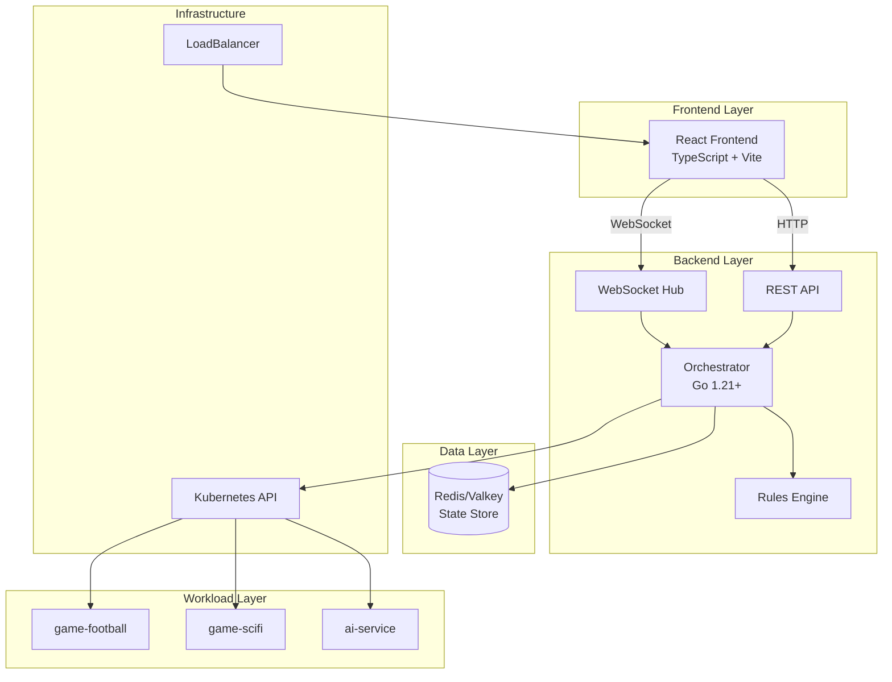
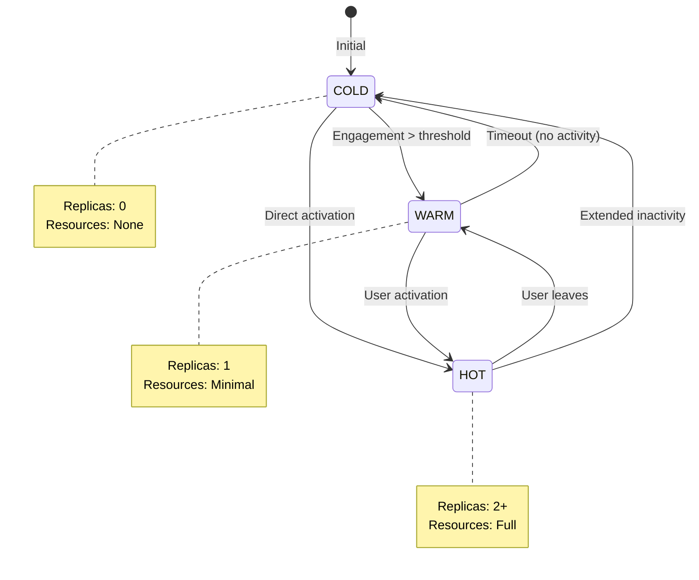
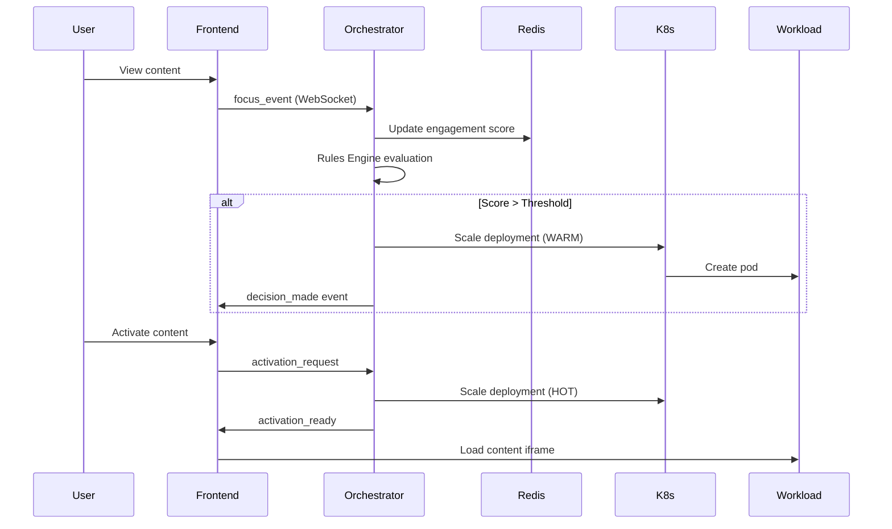
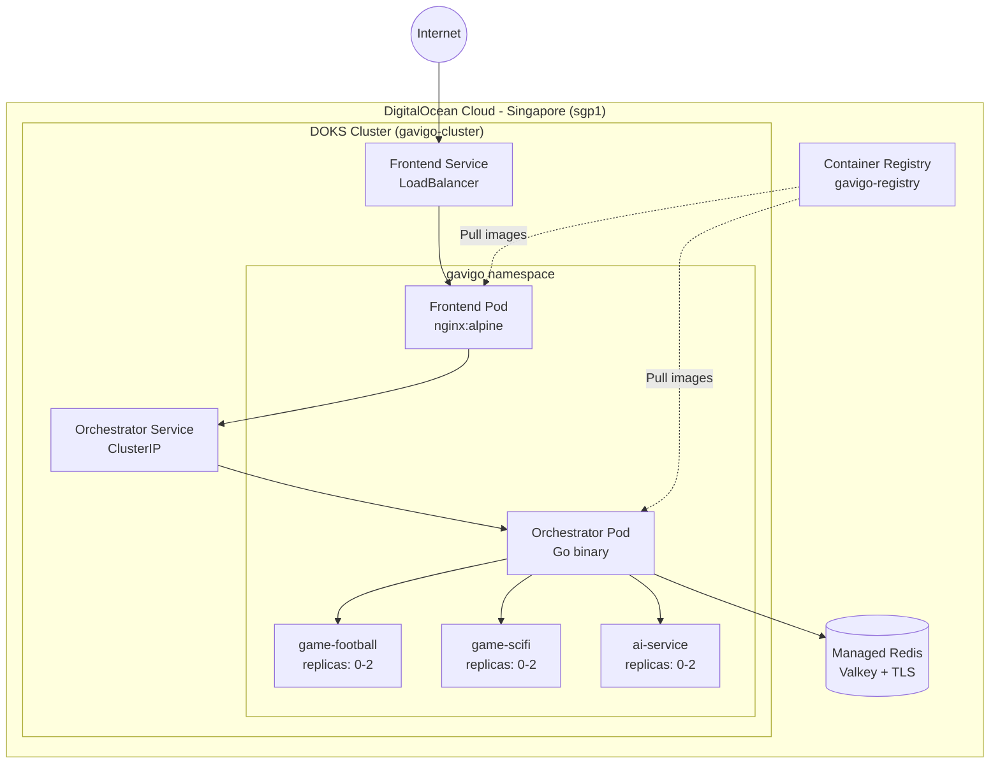
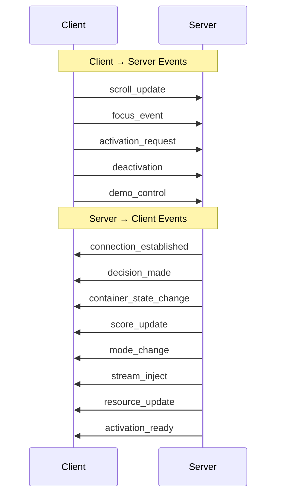

# GAVIGO IRE - Instant Reality Exchange

<div align="center">


**AI-Driven Container Orchestration Visualization Prototype**

[Live Demo](http://129.212.209.146) | [Documentation](#documentation) | [Architecture](#architecture)

</div>

---

## Overview

GAVIGO IRE (Instant Reality Exchange) is a visualization prototype demonstrating AI-driven container orchestration for mixed-media content delivery. The system showcases intelligent resource management where containers transition between COLD, WARM, and HOT states based on user engagement patterns and AI-driven predictions.

## Live Deployment

| Environment | URL | Status |
|-------------|-----|--------|
| Production | http://129.212.209.146 | ✅ Running |

**Infrastructure**: DigitalOcean Kubernetes (DOKS) in Singapore (sgp1)

---

## Key Features

### AI-Driven Orchestration
- **Cross-Domain Recommendations**: Automatically suggests related content across different media types (video → game) based on user engagement
- **Swarm Intelligence**: Detects trending content and proactively warms containers
- **Proactive Warming**: Predicts user intent and prepares containers before activation

### Real-Time Dashboard
- Live AI decision log with reasoning explanations
- Container state visualization (COLD → WARM → HOT)
- Personal, global, and combined score tracking
- Resource allocation charts
- Operational mode indicators

### Interactive Demo
- Mixed-media content stream with engagement tracking
- Full-screen content activation experience
- Demo controls for triggering scenarios

---

## Architecture

### System Overview



### Container State Machine



### Request Flow



### Deployment Architecture (DigitalOcean)



---

## Container States

| State | Replicas | Description | Resource Usage |
|-------|----------|-------------|----------------|
| **COLD** | 0 | No running instances | None |
| **WARM** | 1 | Standby instance ready | Minimal |
| **HOT** | 2+ | Active with full resources | Full |

---

## Technology Stack

### Backend
| Technology | Version | Purpose |
|------------|---------|---------|
| Go | 1.21+ | Orchestrator service |
| gorilla/websocket | 1.5+ | Real-time communication |
| client-go | Latest | Kubernetes API |
| go-redis | v9 | State management |

### Frontend
| Technology | Version | Purpose |
|------------|---------|---------|
| React | 18 | UI framework |
| TypeScript | 5.x | Type safety |
| Vite | 5 | Build tool |
| Tailwind CSS | Latest | Styling |
| shadcn/ui | Latest | UI components |
| Recharts | Latest | Data visualization |

### Infrastructure
| Technology | Provider | Purpose |
|------------|----------|---------|
| Kubernetes | DigitalOcean DOKS | Container orchestration |
| Redis | DigitalOcean Managed (Valkey) | State store + TLS |
| Container Registry | DigitalOcean | Image storage |
| LoadBalancer | DigitalOcean | External access |

---

## Project Structure

```
gavigo/
├── frontend/                 # React frontend application
│   ├── src/
│   │   ├── components/
│   │   │   ├── dashboard/   # Dashboard components
│   │   │   └── stream/      # Media stream components
│   │   ├── hooks/           # Custom React hooks
│   │   ├── services/        # API client
│   │   └── types/           # TypeScript definitions
│   ├── Dockerfile           # Multi-stage build (node → nginx)
│   └── nginx.conf           # Frontend routing config
│
├── orchestrator/            # Go backend service
│   ├── cmd/orchestrator/    # Application entry point
│   └── internal/
│       ├── api/             # HTTP handlers
│       ├── config/          # Configuration management
│       ├── engine/          # Rules engine & scorer
│       ├── k8s/             # Kubernetes client
│       ├── models/          # Data models
│       ├── redis/           # Redis client (TLS support)
│       └── websocket/       # WebSocket hub
│
├── workloads/               # Simulated workload containers
│   ├── game-football/       # Football game workload
│   ├── game-scifi/          # Sci-Fi game workload
│   └── ai-service/          # AI service workload
│
├── k8s/                     # Kubernetes manifests
│   ├── namespace.yaml       # gavigo namespace
│   ├── frontend/            # Frontend deployment + service
│   ├── orchestrator/        # Orchestrator deployment + RBAC
│   └── workloads/           # Workload deployments (cold start)
│
├── specs/                   # Specification documents
│   └── 001-ire-prototype/   # IRE prototype specification
│
├── CLAUDE.md                # Claude Code instructions
├── DEPLOYMENT_STATUS.md     # Current deployment status
├── docker-compose.yml       # Local development setup
└── Makefile                 # Build automation
```

---

## Quick Start

### Prerequisites
- Docker & Docker Compose
- Node.js 18+ (for development)
- Go 1.21+ (for development)
- kubectl (for Kubernetes deployment)
- doctl (for DigitalOcean deployment)

### Local Development with Docker Compose

```bash
# Clone the repository
git clone https://github.com/ChanMeng666/gavigo.git
cd gavigo

# Start all services
docker compose up -d

# View logs
docker compose logs -f

# Access the application
# Frontend: http://localhost:3000
# API: http://localhost:8080
```

### Development Mode

```bash
# Terminal 1: Start backend
cd orchestrator
go run cmd/orchestrator/main.go

# Terminal 2: Start frontend
cd frontend
npm install
npm run dev
```

### Kubernetes Deployment (DigitalOcean)

```bash
# Configure kubectl
doctl kubernetes cluster kubeconfig save gavigo-cluster

# Deploy all components
kubectl apply -f k8s/namespace.yaml
kubectl apply -f k8s/orchestrator/
kubectl apply -f k8s/frontend/
kubectl apply -f k8s/workloads/

# Check status
kubectl -n gavigo get pods,svc,deployments

# Get frontend external IP
kubectl -n gavigo get svc frontend
```

---

## API Reference

### REST Endpoints

| Method | Endpoint | Description |
|--------|----------|-------------|
| GET | `/api/v1/health` | Health check |
| GET | `/api/v1/content` | List all content items |
| GET | `/api/v1/containers` | Get container states |
| GET | `/api/v1/decisions` | Get AI decision history |
| GET | `/api/v1/scores` | Get content scores |
| GET | `/api/v1/mode` | Get current operational mode |
| GET | `/api/v1/resources` | Get resource allocation |
| POST | `/api/v1/demo/reset` | Reset demo state |
| POST | `/api/v1/demo/trend-spike` | Trigger trend spike |

### WebSocket Events



---

## Demo Scenarios

| Scenario | Trigger | Expected Behavior |
|----------|---------|-------------------|
| Cross-Domain Recommendation | Watch football video for 10s+ | System recommends football game |
| Trend Spike | Click "Trend Spike" button | Swarm intelligence warms containers |
| Proactive Warming | Extended engagement on content | AI predicts and warms related content |
| Mode Transition | Focus on game content | System enters Game Focus Mode |

---

## Configuration

### Environment Variables (Orchestrator)

| Variable | Default | Description |
|----------|---------|-------------|
| `PORT` | 8080 | Server port |
| `REDIS_URL` | redis://redis:6379 | Redis connection URL |
| `LOG_LEVEL` | info | Log level (debug/info/warn/error) |
| `ENGAGEMENT_THRESHOLD_MS` | 10000 | Engagement threshold in ms |
| `RECOMMENDATION_THRESHOLD` | 0.6 | Score threshold for recommendations |
| `PERSONAL_SCORE_WEIGHT` | 0.6 | Personal score weight |
| `GLOBAL_SCORE_WEIGHT` | 0.4 | Global score weight |

---

## Deployment Information

### DigitalOcean Resources

| Resource | Name | Specification |
|----------|------|---------------|
| K8s Cluster | gavigo-cluster | 2 nodes, s-2vcpu-4gb |
| Redis | gavigo-redis | Valkey, TLS enabled |
| Registry | gavigo-registry | Basic tier (5 repos) |
| Region | sgp1 | Singapore |

### Container Images

| Image | Registry Path |
|-------|---------------|
| Orchestrator | registry.digitalocean.com/gavigo-registry/orchestrator:latest |
| Frontend | registry.digitalocean.com/gavigo-registry/frontend:latest |
| game-football | registry.digitalocean.com/gavigo-registry/game-football:latest |
| game-scifi | registry.digitalocean.com/gavigo-registry/game-scifi:latest |
| ai-service | registry.digitalocean.com/gavigo-registry/ai-service:latest |

### Monthly Cost Estimate

| Service | Cost |
|---------|------|
| Kubernetes (2 nodes) | ~$24/month |
| Managed Redis (Valkey) | ~$15/month |
| Container Registry (Basic) | ~$5/month |
| Load Balancer (auto-created) | ~$12/month |
| **Total** | **~$56/month** |

---

## Troubleshooting

### Check Pod Status
```bash
kubectl -n gavigo get pods
kubectl -n gavigo describe pod <pod-name>
```

### View Logs
```bash
kubectl -n gavigo logs -l app=orchestrator
kubectl -n gavigo logs -l app=frontend
```

### Restart Deployment
```bash
kubectl -n gavigo rollout restart deployment/orchestrator
kubectl -n gavigo rollout restart deployment/frontend
```

### Check Redis Connection
```bash
kubectl -n gavigo exec -it deployment/orchestrator -- sh
# Inside container:
# Check REDIS_URL environment variable
```

---

## Documentation

- [CLAUDE.md](./CLAUDE.md) - Development guidelines for Claude Code
- [DEPLOYMENT_STATUS.md](./DEPLOYMENT_STATUS.md) - Current deployment status
- [specs/001-ire-prototype/](./specs/001-ire-prototype/) - Feature specification

---

## License

This project is proprietary software. All rights reserved.

## Contributing

This is a private prototype. Please contact the repository owner for contribution guidelines.
