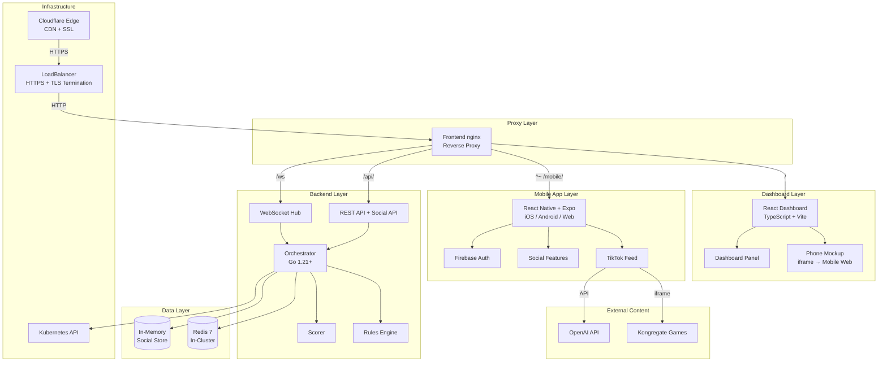
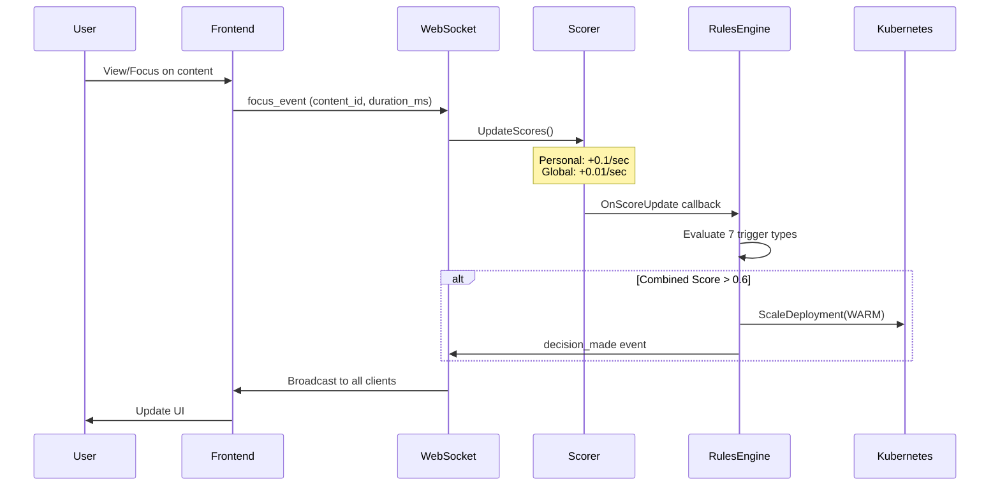
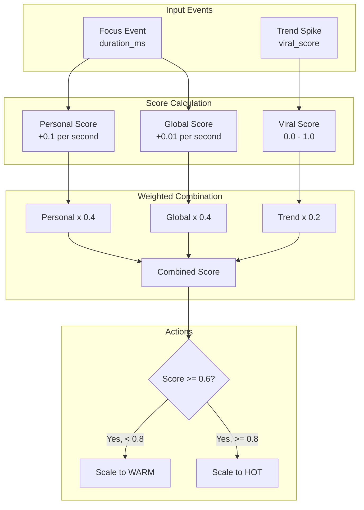
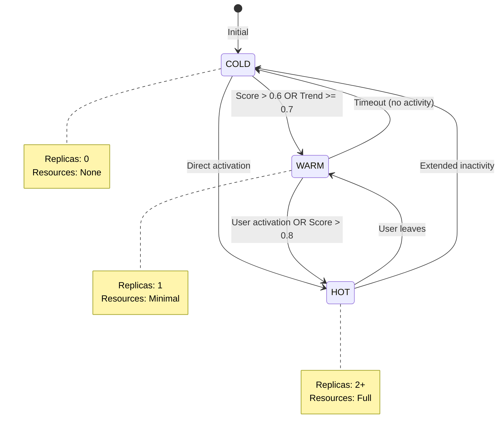
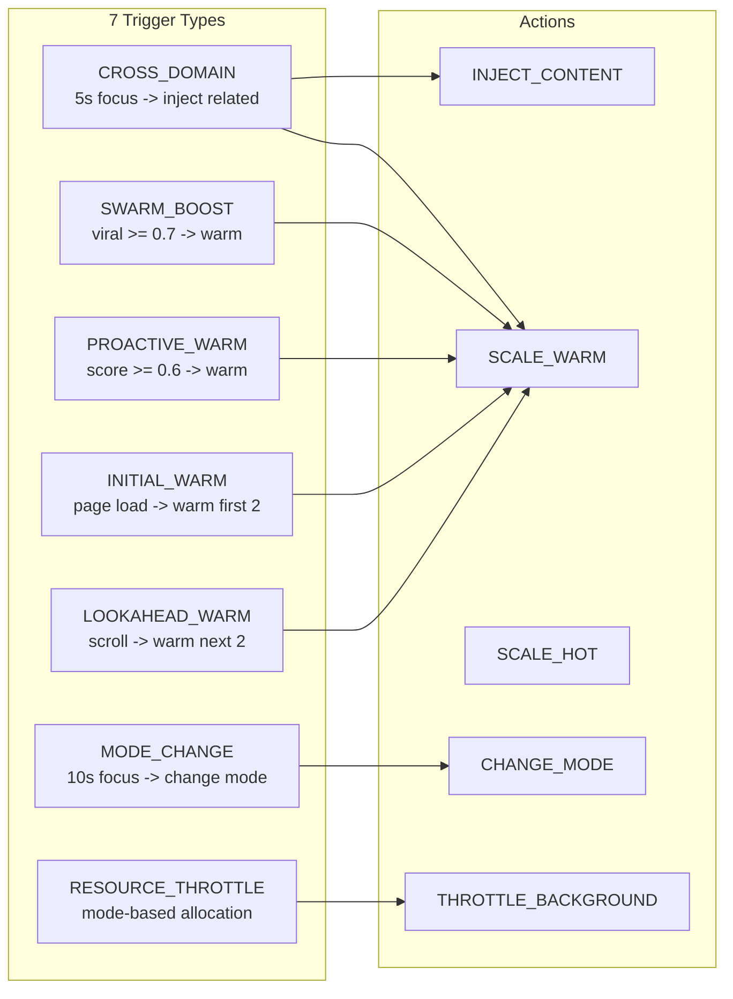
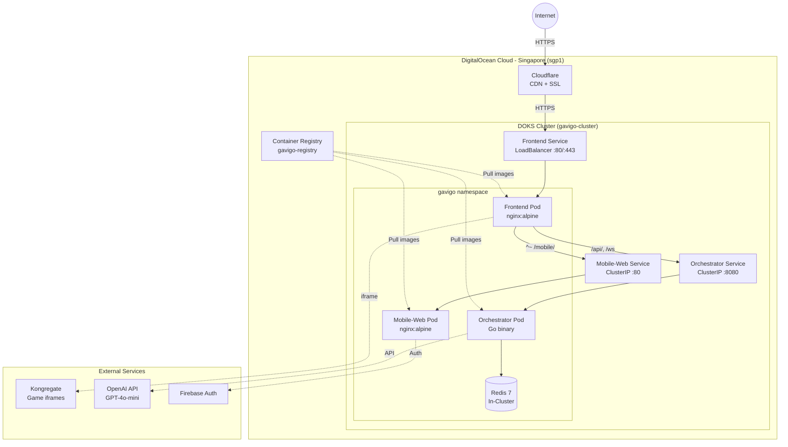
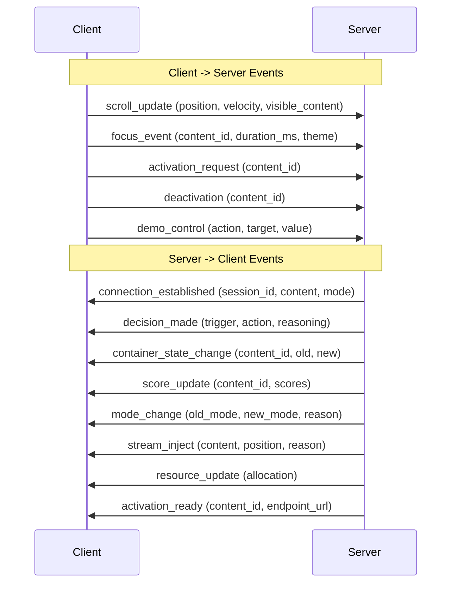

# GAVIGO IRE - Instant Reality Exchange

<div align="center">


**AI-Driven Container Orchestration Visualization with Mobile App**

[Live Demo](https://gavigo.chanmeng.org/) | [Demo Guide](./docs/DEMO_GUIDE.md) | [Architecture](#architecture)

[](https://www.digitalocean.com/?refcode=9ad5295b63f3&utm_campaign=Referral_Invite&utm_medium=Referral_Program&utm_source=badge)

</div>

---

## Overview

GAVIGO IRE (Instant Reality Exchange) is a visualization prototype demonstrating AI-driven container orchestration for mixed-media content delivery. It features:

- A **React Native mobile app** (Expo) with TikTok-style vertical feed, social features (likes, comments, follows), and Firebase Auth — runs on iOS, Android, and Web
- A **React dashboard** for investors showing real-time AI decisions, container states, scores, and resource allocation
- A **Go backend orchestrator** handling WebSocket communication, AI rules engine, Kubernetes scaling, and social API
- The mobile web build is **embedded as an iframe** inside the dashboard's phone mockup, creating a split-screen demo experience

### Key Highlights

- **TikTok-Style Content Stream**: Full-screen vertical scroll with snap points and inline content activation
- **Social Features**: Likes with animation, comments via bottom sheet, follow system, native share
- **External Game Integration**: Iframe-based games from Kongregate and other platforms
- **AI Chat Service**: OpenAI GPT-4o-mini powered chat interface
- **Real-Time AI Decisions**: 7 trigger types for intelligent resource management
- **Weighted Scoring System**: Personal, global, and trend scores combined for predictions
- **Cross-Platform**: Single codebase runs on iOS, Android, and Web

## Live Deployment

| Environment | URL | Status |
|-------------|-----|--------|
| Production | https://gavigo.chanmeng.org/ | Running |

**Infrastructure**: DigitalOcean Kubernetes (DOKS) in Singapore (sgp1)

---

## Key Features

### Mobile App (React Native + Expo)

- **4 Tabs**: Feed, Explore, AI Chat, Profile
- **TikTok-Style Feed**: Vertical FlatList with paging, auto-play videos, game embeds, AI chat
- **Social**: Like (animated heart), Comment (bottom sheet), Follow, Share (native share sheet)
- **Auth**: Firebase Auth on native (email/password, Google, Apple), demo auto-login on web
- **Real-Time**: WebSocket connection for container state updates, score changes, AI decisions

### AI-Driven Orchestration

- **Cross-Domain Recommendations**: Automatically suggests related content across different media types based on theme matching (e.g., football video -> idle game)
- **Swarm Intelligence**: Detects trending content (viral score >= 0.7) and proactively warms containers
- **Proactive Warming**: Predicts user intent and prepares containers before activation when engagement score exceeds 0.6

### Real-Time Dashboard

- Live AI decision log with reasoning explanations
- Container state visualization (COLD -> WARM -> HOT)
- Personal, global, and combined score tracking
- Resource allocation charts
- Operational mode indicators

### Interactive Demo Controls

- Viral score slider for testing swarm intelligence
- Force state buttons (WARM/COLD)
- Trend spike trigger
- Reset demo button

---

## Architecture

### System Overview



### Request Routing (nginx)

```
Internet → Cloudflare (HTTPS) → DO LoadBalancer :443 (TLS termination) → Frontend nginx :80
    ├── /               → React Dashboard (SPA)
    ├── ^~ /mobile/     → Mobile Web App (Expo web build, proxied to mobile-web service)
    ├── /api/           → Orchestrator (Go REST API)
    ├── /ws             → Orchestrator (WebSocket, with Upgrade headers)
    └── ^~ /workloads/  → AI Service, Game workloads
```

> **Note**: `^~` prefix match on `/mobile/` and `/workloads/` is required to prevent the static asset caching regex from intercepting proxied JS/CSS files.

### AI Decision Pipeline



### Scoring Algorithm



### Container State Machine



### AI Trigger Types



### Deployment Architecture (DigitalOcean)



---

## Content Items

The demo includes 11 content items across 3 types:

### Videos (5 items)

| ID | Theme | Title | Description |
|----|-------|-------|-------------|
| video-football-1 | football | Football Highlights | Amazing football moments |
| video-football-2 | football | Top Goals 2024 | Best goals of the season |
| video-football-3 | football | Championship Finals | The ultimate showdown |
| video-scifi-1 | scifi | Space Documentary | Exploring the cosmos |
| video-scifi-2 | scifi | Deep Space Journey | Venturing into the unknown |

### Games - External iframes (5 items)

| ID | Theme | Title | Source |
|----|-------|-------|--------|
| game-clicker-heroes | idle | Clicker Heroes | Kongregate (150M+ plays) |
| game-mrmine | mining | Mr.Mine | Kongregate (20M+ plays) |
| game-poker-quest | cards | Poker Quest | Roguelike poker |
| game-grindcraft | craft | Grindcraft | Minecraft-style idle (10M+ plays) |
| game-fray-fight | fighting | Fray Fight | Action fighting |

### AI Service (1 item)

| ID | Theme | Title | Backend |
|----|-------|-------|---------|
| ai-service-tech | tech | AI Assistant | OpenAI GPT-4o-mini |

### Cross-Domain Relations

When users engage with content for 5+ seconds, the system recommends related content:

| Video Theme | Recommended Game |
|-------------|-----------------|
| football | game-clicker-heroes |
| scifi | game-mrmine |
| tech | ai-service-tech |

---

## Container States

| State | Replicas | Description | Resource Usage |
|-------|----------|-------------|----------------|
| **COLD** | 0 | No running instances | None |
| **WARM** | 1 | Standby instance ready | Minimal |
| **HOT** | 2+ | Active with full resources | Full |

---

## Technology Stack

### Mobile App
| Technology | Version | Purpose |
|------------|---------|---------|
| React Native | 0.81 | Cross-platform mobile framework |
| Expo | SDK 54 | Managed workflow, OTA updates, web support |
| Expo Router | v6 | File-based navigation with deep linking |
| NativeWind | v4 | TailwindCSS for React Native |
| Zustand | 5.x | Lightweight state management |
| Firebase Auth | 23.x | Authentication (email/password, Google, Apple) |
| expo-av | 16.x | Native video playback |
| react-native-webview | 13.x | Game iframe embedding (native) |
| react-native-reanimated | v4 | 60fps native animations |
| @gorhom/bottom-sheet | v5 | Comment panel |

### Dashboard (Frontend)
| Technology | Version | Purpose |
|------------|---------|---------|
| React | 18 | UI framework |
| TypeScript | 5.x | Type safety |
| Vite | 5 | Build tool |
| Tailwind CSS | Latest | Styling |
| shadcn/ui | Latest | UI components |
| Recharts | Latest | Data visualization |

### Backend
| Technology | Version | Purpose |
|------------|---------|---------|
| Go | 1.21+ | Orchestrator service |
| gorilla/websocket | 1.5+ | Real-time communication |
| client-go | Latest | Kubernetes API |
| go-redis | v9 | State management |

### Infrastructure
| Technology | Provider | Purpose |
|------------|----------|---------|
| Kubernetes | DigitalOcean DOKS | Container orchestration |
| Redis | In-cluster redis:7-alpine | State store (no TLS) |
| Container Registry | DigitalOcean | Image storage (4 images) |
| Load Balancer | DigitalOcean REGIONAL | HTTPS termination (Cloudflare Origin CA) |
| CDN / SSL | Cloudflare | Edge caching, SSL/TLS Full (strict) |
| Firebase | Google | Mobile authentication |

---

## Project Structure

```
gavigo/
├── mobile/                      # React Native + Expo mobile app
│   ├── app/                     # Expo Router file-based routing
│   │   ├── index.tsx            # Root redirect (auth → feed, guest → login)
│   │   ├── _layout.tsx          # Root layout with AuthGuard
│   │   ├── (auth)/              # Auth screens
│   │   │   ├── login.tsx        # Email/password login
│   │   │   ├── register.tsx     # Create account
│   │   │   └── forgot-password.tsx
│   │   └── (tabs)/              # Main app tabs
│   │       ├── _layout.tsx      # Tab bar (4 tabs)
│   │       ├── feed/index.tsx   # TikTok-style vertical feed
│   │       ├── explore/index.tsx # Content grid + filters
│   │       ├── chat/index.tsx   # AI chat interface
│   │       └── profile/index.tsx # User profile + settings
│   ├── components/
│   │   ├── feed/                # ContentCard, VideoPlayer, GameEmbed, AIChatEmbed
│   │   ├── social/              # LikeButton, CommentSheet, FollowButton, ShareButton
│   │   ├── profile/             # Profile UI components
│   │   └── ui/                  # Base UI components
│   ├── hooks/                   # useAuth(.web), useWebSocket, useEngagement
│   ├── services/                # api.ts, firebase(.web).ts
│   ├── stores/                  # authStore, feedStore, socialStore (Zustand)
│   ├── types/                   # TypeScript types
│   ├── Dockerfile               # node:20-alpine → nginx:alpine
│   └── app.json                 # Expo config (baseUrl: /mobile)
│
├── frontend/                    # React dashboard (investor demo)
│   ├── src/
│   │   ├── components/
│   │   │   ├── dashboard/       # AI Decision Log, Container Status, Scores, etc.
│   │   │   ├── stream/          # MediaStream, PhoneMockup, TikTokContentView
│   │   │   ├── layout/          # AppShell, Header, ConnectionStatus
│   │   │   └── ui/              # shadcn/ui components
│   │   ├── hooks/               # useWebSocket, useEngagement
│   │   ├── services/            # REST API client
│   │   └── types/               # TypeScript definitions
│   ├── Dockerfile               # Sets VITE_RN_WEB_URL=/mobile/
│   └── nginx.conf               # Reverse proxy with ^~ locations
│
├── orchestrator/                # Go backend service
│   ├── cmd/orchestrator/        # Entry point
│   └── internal/
│       ├── api/                 # handlers.go + social_handlers.go
│       ├── config/              # Configuration
│       ├── engine/              # Rules engine (7 triggers) + Scorer
│       ├── k8s/                 # Kubernetes client, scaler, watcher
│       ├── models/              # Content, Decision, Events, Session, Social
│       ├── redis/               # Redis client (TLS), Pub/Sub, Scores
│       └── websocket/           # WebSocket hub + handlers
│
├── workloads/                   # Workload containers
│   └── ai-service/              # AI chat (Express + OpenAI)
│
├── k8s/                         # Kubernetes manifests
│   ├── frontend/                # Frontend deployment + LoadBalancer
│   ├── orchestrator/            # Orchestrator deployment + RBAC
│   ├── mobile-web/              # Mobile web deployment + ClusterIP
│   └── workloads/               # AI service deployment
│
├── docs/                        # Documentation
│   ├── DEMO_GUIDE.md            # Demo walkthrough
│   └── DEPLOYMENT_STATUS.md     # Current deployment status
│
├── specs/                       # Specification documents
│   └── 001-ire-prototype/       # IRE prototype specification
│
├── CLAUDE.md                    # Claude Code instructions
├── docker-compose.yml           # Local development
└── Makefile                     # Build automation
```

---

## Quick Start

### Prerequisites
- Docker & Docker Compose
- Node.js 20+ (for development)
- Go 1.21+ (for backend development)
- kubectl (for Kubernetes deployment)
- doctl (for DigitalOcean deployment)

### Local Development with Docker Compose

```bash
# Clone the repository
git clone https://github.com/ChanMeng666/gavigo.git
cd gavigo

# Start all services
docker compose up -d

# View logs
docker compose logs -f

# Access the application
# Frontend: http://localhost:3000
# API: http://localhost:8080
```

### Development Mode

```bash
# Terminal 1: Start backend
cd orchestrator
go run cmd/orchestrator/main.go

# Terminal 2: Start frontend dashboard
cd frontend
npm install
npm run dev

# Terminal 3: Start mobile app (web)
cd mobile
npm install
npx expo start --web
```

### Kubernetes Deployment (DigitalOcean)

```bash
# Configure kubectl
doctl kubernetes cluster kubeconfig save gavigo-cluster

# Build and push all images
docker build -t registry.digitalocean.com/gavigo-registry/orchestrator:latest -f orchestrator/Dockerfile orchestrator/
docker build -t registry.digitalocean.com/gavigo-registry/frontend:latest -f frontend/Dockerfile frontend/
docker build -t registry.digitalocean.com/gavigo-registry/mobile-web:latest -f mobile/Dockerfile mobile/
docker push registry.digitalocean.com/gavigo-registry/orchestrator:latest
docker push registry.digitalocean.com/gavigo-registry/frontend:latest
docker push registry.digitalocean.com/gavigo-registry/mobile-web:latest

# Deploy all components
kubectl apply -f k8s/namespace.yaml
kubectl apply -f k8s/orchestrator/
kubectl apply -f k8s/frontend/
kubectl apply -f k8s/mobile-web/
kubectl apply -f k8s/workloads/

# Check status
kubectl -n gavigo get pods,svc,deployments

# Get frontend external IP
kubectl -n gavigo get svc frontend
```

---

## API Reference

### Core REST Endpoints

| Method | Endpoint | Description |
|--------|----------|-------------|
| GET | `/api/v1/health` | Health check |
| GET | `/api/v1/content` | List all content items |
| GET | `/api/v1/content/:id` | Get single content item |
| GET | `/api/v1/containers` | Get container states |
| GET | `/api/v1/decisions` | Get AI decision history |
| GET | `/api/v1/scores` | Get content scores |
| GET | `/api/v1/mode` | Get current operational mode |
| GET | `/api/v1/resources` | Get resource allocation |
| POST | `/api/v1/demo/reset` | Reset demo state |
| POST | `/api/v1/demo/trend-spike` | Trigger trend spike |

### Social API Endpoints

| Method | Endpoint | Description |
|--------|----------|-------------|
| GET | `/api/v1/users/me` | Get current user profile |
| POST | `/api/v1/users/profile` | Create/update profile |
| POST | `/api/v1/content/:id/like` | Like content |
| DELETE | `/api/v1/content/:id/like` | Unlike content |
| GET | `/api/v1/content/:id/comments` | Get comments |
| POST | `/api/v1/content/:id/comments` | Post comment |
| POST | `/api/v1/users/:id/follow` | Follow user |
| DELETE | `/api/v1/users/:id/follow` | Unfollow user |

### WebSocket Events



---

## Demo Scenarios

| Scenario | Trigger | Expected Behavior |
|----------|---------|-------------------|
| Cross-Domain Recommendation | Watch football video for 5s+ | System injects game-clicker-heroes |
| Trend Spike | Click "Trend Spike" button | Swarm intelligence warms containers |
| Proactive Warming | Extended engagement (score > 0.6) | Container transitions COLD -> WARM |
| Mode Transition | Focus on game for 10s+ | System enters GAME_FOCUS_MODE |
| Lookahead Warming | Scroll through content | Next 2 items pre-warmed |
| Social Interaction | Like/comment on content | Counts update in real-time |

---

## Configuration

### Environment Variables (Orchestrator)

| Variable | Default | Description |
|----------|---------|-------------|
| `PORT` | 8080 | Server port |
| `REDIS_URL` | redis://redis:6379 | Redis connection URL |
| `LOG_LEVEL` | info | Log level (debug/info/warn/error) |
| `ENGAGEMENT_THRESHOLD_MS` | 10000 | Engagement threshold in ms |
| `RECOMMENDATION_THRESHOLD` | 0.6 | Score threshold for warming |
| `PERSONAL_SCORE_WEIGHT` | 0.4 | Personal score weight |
| `GLOBAL_SCORE_WEIGHT` | 0.4 | Global score weight |

### Environment Variables (Frontend)

| Variable | Default | Description |
|----------|---------|-------------|
| `VITE_RN_WEB_URL` | `/mobile/` | URL for mobile web iframe (empty = CSS fallback) |

---

## Deployment Information

### DigitalOcean Resources

| Resource | Name | Specification |
|----------|------|---------------|
| K8s Cluster | gavigo-cluster | 1 node, sgp1 |
| Redis | In-cluster | redis:7-alpine (no TLS) |
| Registry | gavigo-registry | Basic tier (5 repos) |
| Load Balancer | REGIONAL (HTTP) | HTTPS via Cloudflare Origin CA |
| Region | sgp1 | Singapore |

### Container Images

| Image | Registry Path |
|-------|---------------|
| Orchestrator | registry.digitalocean.com/gavigo-registry/orchestrator:latest |
| Frontend | registry.digitalocean.com/gavigo-registry/frontend:latest |
| Mobile Web | registry.digitalocean.com/gavigo-registry/mobile-web:latest |
| ai-service | registry.digitalocean.com/gavigo-registry/ai-service:latest |

### Monthly Cost Estimate

| Service | Cost |
|---------|------|
| Kubernetes (1 node) | ~$12/month |
| Redis (in-cluster) | $0 (runs in cluster) |
| Container Registry (Basic) | ~$5/month |
| Load Balancer (REGIONAL) | ~$12/month |
| Cloudflare (Free plan) | $0 |
| **Total** | **~$29/month** |

---

## Troubleshooting

### Check Pod Status
```bash
kubectl -n gavigo get pods
kubectl -n gavigo describe pod <pod-name>
```

### View Logs
```bash
kubectl -n gavigo logs -l app=orchestrator
kubectl -n gavigo logs -l app=frontend
kubectl -n gavigo logs -l app=mobile-web
```

### Restart Deployment
```bash
kubectl -n gavigo rollout restart deployment/orchestrator
kubectl -n gavigo rollout restart deployment/frontend
kubectl -n gavigo rollout restart deployment/mobile-web
```

### Check Redis Connection
```bash
# Verify redis pod is running
kubectl -n gavigo get pods -l app=redis
# Check REDIS_URL in orchestrator config
kubectl -n gavigo get configmap orchestrator-config -o yaml | grep REDIS
```

### Mobile Web Black Screen
- Verify nginx has `^~` on `/mobile/` location
- Check mobile-web pod: `kubectl -n gavigo get pods -l app=mobile-web`
- Test proxy: `kubectl -n gavigo exec deployment/frontend -- wget -qO- http://mobile-web:80/`

---

## Documentation

- [CLAUDE.md](./CLAUDE.md) - Development guidelines for Claude Code
- [docs/DEPLOYMENT_STATUS.md](./docs/DEPLOYMENT_STATUS.md) - Current deployment status
- [docs/DEMO_GUIDE.md](./docs/DEMO_GUIDE.md) - Demo walkthrough and technical explanations
- [docs/HTTPS_SETUP_GUIDE.md](./docs/HTTPS_SETUP_GUIDE.md) - HTTPS setup with Cloudflare Origin CA + DO Load Balancer
- [docs/EXPO_WEB_PITFALLS.md](./docs/EXPO_WEB_PITFALLS.md) - Expo web platform pitfalls and debugging
- [specs/001-ire-prototype/](./specs/001-ire-prototype/) - Feature specification

---

## License

This project is licensed under the [MIT License](./LICENSE).

## Contributing

This is a private prototype. Please contact the repository owner for contribution guidelines.
