# GAVIGO IRE Demo Guide

> A comprehensive guide to testing and understanding all features of the GAVIGO IRE prototype.

**Live Demo**: http://129.212.209.146

---

## Table of Contents

1. [Introduction](#introduction)
2. [Quick Start](#quick-start)
3. [Interface Overview](#interface-overview)
4. [Feature Demonstrations](#feature-demonstrations)
   - [TikTok-Style Content Stream](#1-tiktok-style-content-stream)
   - [Container State Visualization](#2-container-state-visualization)
   - [AI Decision Log](#3-ai-decision-log)
   - [Engagement Scoring](#4-engagement-scoring)
   - [Cross-Domain Recommendations](#5-cross-domain-recommendations)
   - [Proactive Warming](#6-proactive-warming)
   - [Trend Spike (Swarm Intelligence)](#7-trend-spike-swarm-intelligence)
   - [Mode Transitions](#8-mode-transitions)
   - [Game Activation](#9-game-activation)
   - [AI Chat Service](#10-ai-chat-service)
5. [Demo Controls Panel](#demo-controls-panel)
6. [Technical Architecture](#technical-architecture)
7. [Troubleshooting](#troubleshooting)

---

## Introduction

GAVIGO IRE (Instant Reality Exchange) demonstrates AI-driven container orchestration for mixed-media content delivery. The system intelligently manages computing resources by transitioning containers between COLD, WARM, and HOT states based on user engagement patterns and AI predictions.

### What This Demo Showcases

- **Intelligent Resource Management**: Containers scale up/down based on predicted user intent
- **Cross-Domain Content Discovery**: AI recommends related content across different media types
- **Real-Time Decision Making**: See AI decisions with full reasoning explanations
- **TikTok-Style UX**: Modern vertical scrolling interface with inline content activation

### Target Audience

- DevOps engineers interested in intelligent orchestration
- Product managers exploring AI-driven UX patterns
- Developers learning about WebSocket-based real-time systems

---

## Quick Start

### Access the Demo

1. Open your browser and navigate to: **http://129.212.209.146**
2. The page will automatically connect via WebSocket
3. Look for the green "Connected" indicator in the header

### First Things to Try

1. **Scroll through content** - Watch the container states change
2. **Focus on a video for 5+ seconds** - See cross-domain recommendations appear
3. **Open the Demo Controls** - Try triggering a trend spike
4. **Activate a game** - Watch the inline iframe load

---

## Interface Overview

The interface has three main views, accessible via the toggle in the header:

### Split View (Default)

```
┌────────────────────────────────────────────────────────────┐
│  Header: Connection Status | View Toggle                    │
├──────────────────────┬─────────────────────────────────────┤
│                      │                                      │
│   Content Stream     │         Dashboard                    │
│   (TikTok-style)     │   ┌──────────────────────────────┐  │
│                      │   │  Mode Indicator              │  │
│   ┌──────────────┐   │   ├──────────────────────────────┤  │
│   │              │   │   │  Demo Controls               │  │
│   │   Content    │   │   ├──────────────────────────────┤  │
│   │    Card      │   │   │  AI Decision Log             │  │
│   │              │   │   ├──────────────────────────────┤  │
│   └──────────────┘   │   │  Score Display               │  │
│                      │   ├──────────────────────────────┤  │
│   • • • (dots)       │   │  Resource Chart              │  │
│                      │   └──────────────────────────────┘  │
└──────────────────────┴─────────────────────────────────────┘
```

### Stream Only View

Full-width TikTok-style content stream for mobile or focused viewing.

### Dashboard Only View

Full-width dashboard for monitoring AI decisions and system state.

---

## Feature Demonstrations

### 1. TikTok-Style Content Stream

#### How to Test

1. Navigate to the content stream (left panel or stream-only view)
2. Scroll up/down through the content cards
3. Notice the snap scrolling behavior
4. Observe the pagination dots on the right side

#### What to Observe

- Content cards snap to full height
- Smooth scrolling with momentum
- Pagination dots indicate current position
- Swipe hint animation appears initially

#### Technical Principle

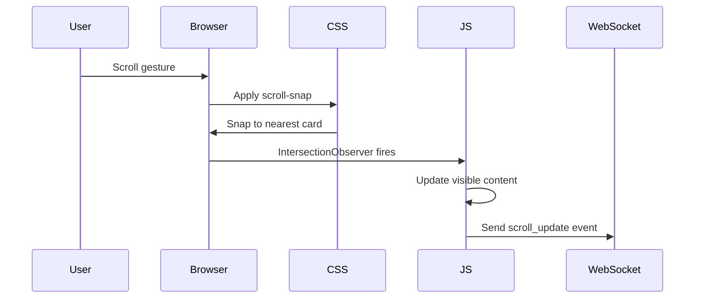

**Key Technologies:**
- **CSS scroll-snap**: `scroll-snap-type: y mandatory` ensures cards snap to full height
- **IntersectionObserver**: Detects which content is visible with 200px root margin
- **Touch events**: Handles swipe gestures on mobile

---

### 2. Container State Visualization

#### How to Test

1. Look at the container status cards in the dashboard
2. Observe the colored badges: COLD (blue), WARM (yellow), HOT (red)
3. Scroll through content and watch states change

#### What to Observe

- COLD: Container not running (0 replicas)
- WARM: Standby instance ready (1 replica)
- HOT: Active with full resources (2+ replicas)
- Replica count shown next to each state

#### Technical Principle

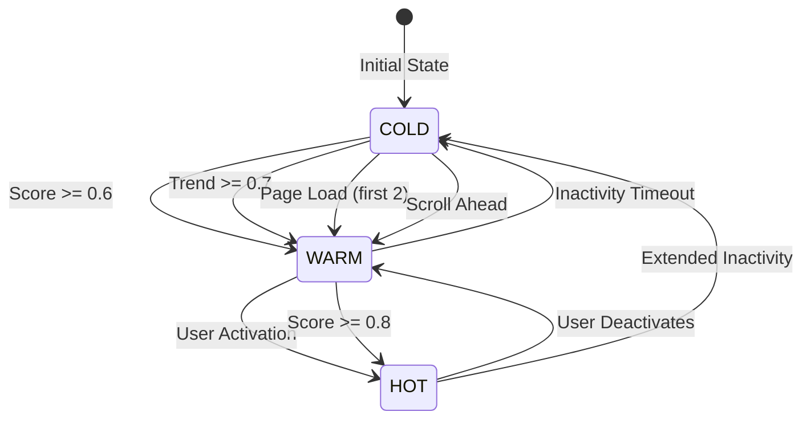

**State Mapping to Kubernetes:**
- COLD: `replicas: 0` - No pods running
- WARM: `replicas: 1` - Single pod in standby
- HOT: `replicas: 2` - Multiple pods for active service

---

### 3. AI Decision Log

#### How to Test

1. Open the dashboard view
2. Watch the AI Decision Log panel
3. Scroll through content or use demo controls
4. See new decisions appear with animations

#### What to Observe

- **Trigger Type**: What caused the decision (CROSS_DOMAIN, SWARM_BOOST, etc.)
- **Action**: What the AI did (INJECT_CONTENT, SCALE_WARM, etc.)
- **Reasoning**: Human-readable explanation
- **Scores**: Input scores that triggered the decision
- **Timestamp**: When the decision was made

#### Technical Principle

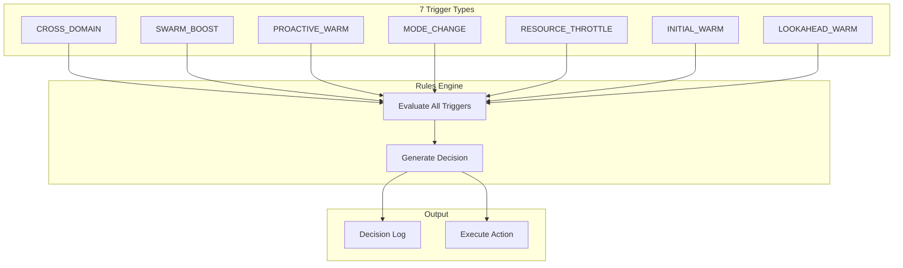

**Decision Structure:**
```json
{
  "decision_id": "1706123456789",
  "trigger_type": "PROACTIVE_WARM",
  "affected_content_id": "game-clicker-heroes",
  "reasoning_text": "User engagement score exceeded threshold...",
  "input_scores": {
    "personal_score": 0.45,
    "global_score": 0.20,
    "combined_score": 0.62
  },
  "resulting_action": "SCALE_WARM",
  "success": true
}
```

---

### 4. Engagement Scoring

#### How to Test

1. Open the Score Display panel in the dashboard
2. Focus on any content item for several seconds
3. Watch the score bars fill up
4. Notice when scores exceed the 0.6 threshold

#### What to Observe

- **Personal Score**: Your individual engagement (green bar)
- **Global Score**: Aggregate across all users (blue bar)
- **Combined Score**: Weighted combination (purple bar)
- **Threshold Line**: Shows 0.6 warming threshold

#### Technical Principle

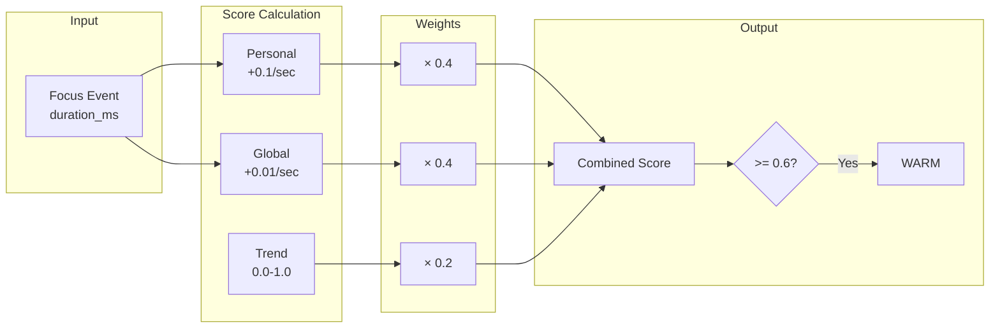

**Formula:**
```
Combined = (Personal × 0.4) + (Global × 0.4) + (Trend × 0.2)
```

**Score Decay:**
- All scores decay by 1% every 5 seconds
- Prevents stale engagement from triggering actions

---

### 5. Cross-Domain Recommendations

#### How to Test

1. Find a video content item (e.g., "Football Highlights")
2. Focus on it for **5+ seconds** (keep it visible in viewport)
3. Watch for a new content item to appear in the stream
4. Check the AI Decision Log for CROSS_DOMAIN trigger

#### What to Observe

- Related content is injected into the stream
- Decision log shows reasoning: "Cross-domain recommendation..."
- The recommended content is pre-warmed to WARM state

#### Technical Principle

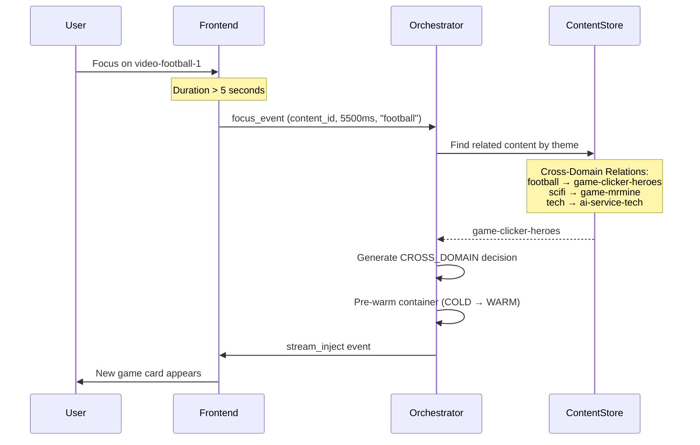

**Cross-Domain Mapping:**
| Video Theme | Recommended Content |
|-------------|-------------------|
| football | game-clicker-heroes |
| scifi | game-mrmine |
| tech | ai-service-tech |

---

### 6. Proactive Warming

#### How to Test

1. Find a COLD content item (blue badge)
2. Focus on it by keeping it visible
3. Watch the Score Display - wait for combined score to exceed 0.6
4. Observe the container transition from COLD to WARM

#### What to Observe

- Score bars gradually fill as you engage
- When combined score crosses 0.6, container warms
- AI Decision Log shows PROACTIVE_WARM trigger
- "Activate" button becomes available faster

#### Technical Principle

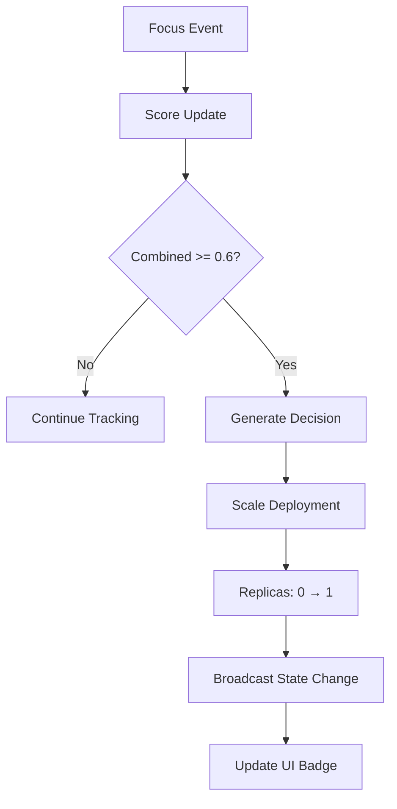

**Thresholds:**
- **0.6**: Trigger WARM state (1 replica)
- **0.8**: Trigger HOT state (2+ replicas)

---

### 7. Trend Spike (Swarm Intelligence)

#### How to Test

1. Open the Demo Controls panel (click to expand)
2. Find the "Viral Score" slider
3. Drag it to 0.7 or higher
4. Click "Apply Trend Spike"
5. Watch containers immediately warm

#### What to Observe

- Multiple containers may warm simultaneously
- AI Decision Log shows SWARM_BOOST trigger
- Reasoning mentions "viral trend detected"
- Fast response regardless of personal engagement

#### Technical Principle

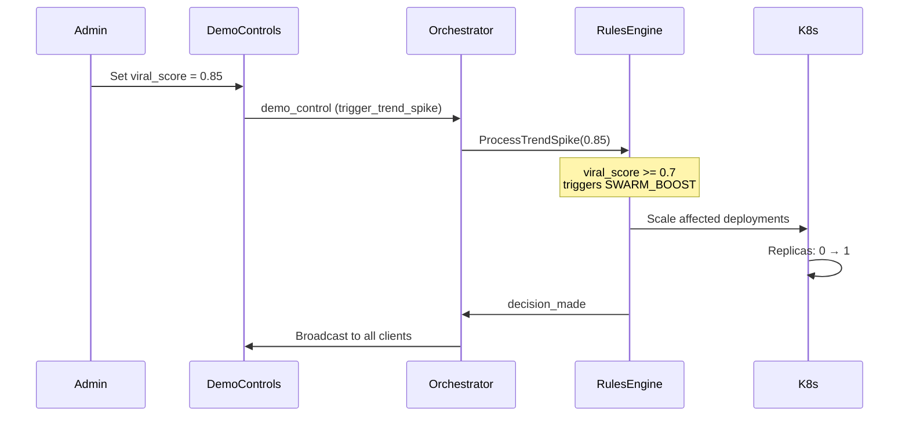

**Swarm Intelligence Logic:**
- Simulates viral content detection
- Threshold: `viral_score >= 0.7`
- Proactively warms containers before user demand
- Useful for live events, trending topics

---

### 8. Mode Transitions

#### How to Test

1. Find a game content item
2. Focus on it for **10+ seconds**
3. Watch the Mode Indicator change
4. Observe resource allocation chart

#### What to Observe

- Mode changes from MIXED_STREAM_BROWSING to GAME_FOCUS_MODE
- Resource allocation shifts (70% active, 20% warm, 10% background)
- AI Decision Log shows MODE_CHANGE trigger
- Other containers may be throttled

#### Technical Principle

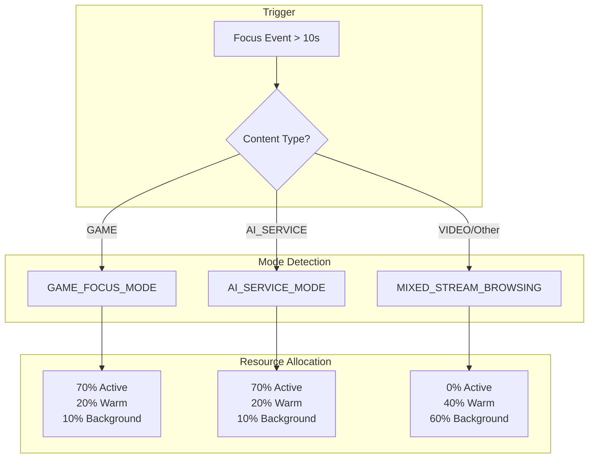

**Operational Modes:**
| Mode | Active | Warm | Background |
|------|--------|------|------------|
| MIXED_STREAM_BROWSING | 0% | 40% | 60% |
| GAME_FOCUS_MODE | 70% | 20% | 10% |
| AI_SERVICE_MODE | 70% | 20% | 10% |

---

### 9. Game Activation

#### How to Test

1. Find a game content item (e.g., "Clicker Heroes")
2. Wait for it to reach WARM state (or use demo controls)
3. Click the "Activate" button
4. Watch the game load inline

#### What to Observe

- Loading state with animated icon while waiting
- Game loads in an iframe within the content card
- No popup or modal - plays inline
- Container transitions to HOT state

#### Technical Principle

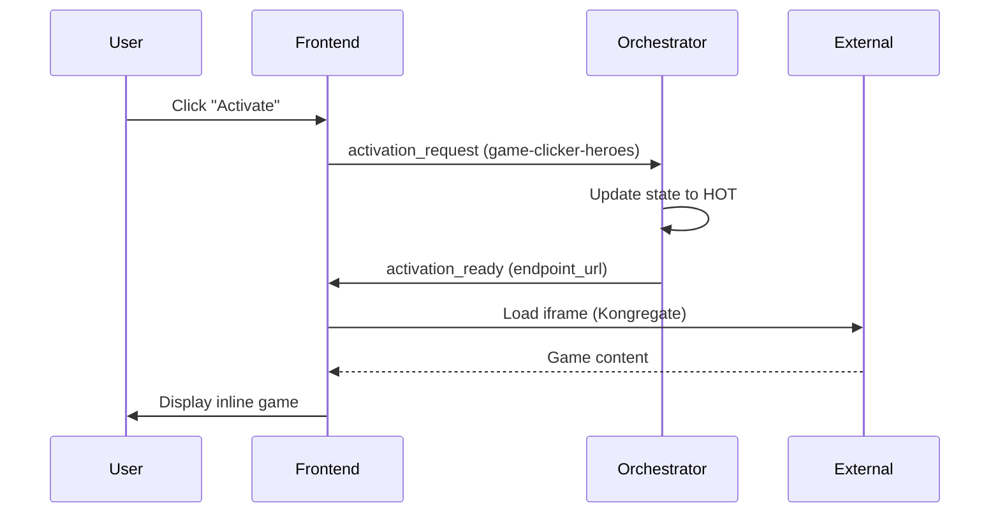

**External Game Sources:**
| Game | Source |
|------|--------|
| Clicker Heroes | Kongregate |
| Mr.Mine | Kongregate |
| Poker Quest | External |
| Grindcraft | External |
| Fray Fight | External |

---

### 10. AI Chat Service

#### How to Test

1. Find the "AI Assistant" content item
2. Activate it
3. Type a message in the chat input
4. Wait for AI response

#### What to Observe

- Chat interface with message history
- "Thinking..." indicator while waiting
- AI response appears in chat
- Works with fallback if OpenAI not configured

#### Technical Principle

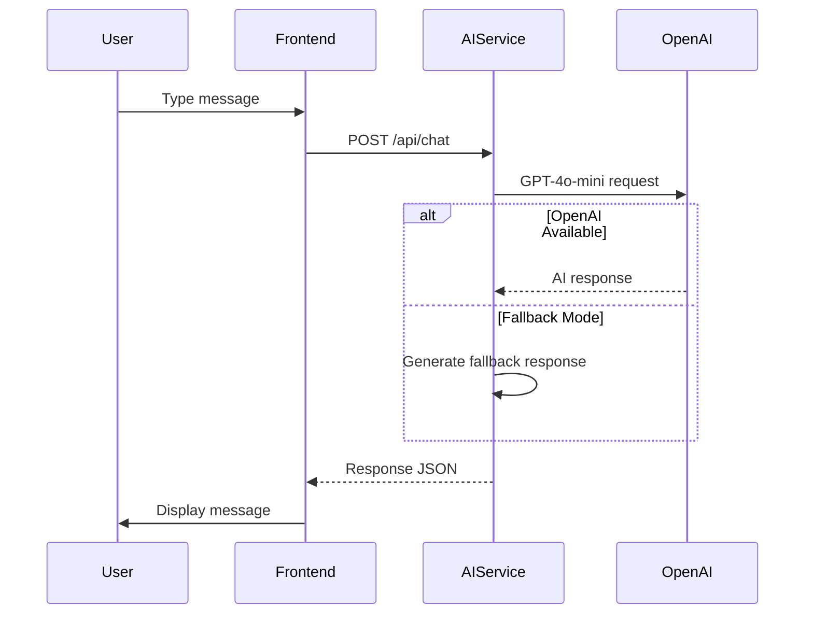

**Fallback Responses:**
When OpenAI API is not configured, the service provides helpful preset responses about GAVIGO IRE's features.

---

## Demo Controls Panel

The Demo Controls panel allows you to manually trigger scenarios for testing.

### Available Controls

| Control | Function |
|---------|----------|
| **Viral Score Slider** | Set trend/viral score (0.0 - 1.0) |
| **Apply Trend Spike** | Trigger SWARM_BOOST with current viral score |
| **Force WARM** | Manually set a content's state to WARM |
| **Force COLD** | Manually set a content's state to COLD |
| **Reset Demo** | Clear all scores and reset to initial state |

### Recommended Test Sequence

1. **Reset Demo** - Start fresh
2. **Observe Initial Warm** - First 2 items should warm automatically
3. **Scroll** - Watch lookahead warming
4. **Focus on Video** - See cross-domain after 5s
5. **Apply Trend Spike (0.85)** - See swarm intelligence
6. **Focus on Game (10s)** - See mode change
7. **Activate Game** - See inline loading

---

## Technical Architecture

### System Overview

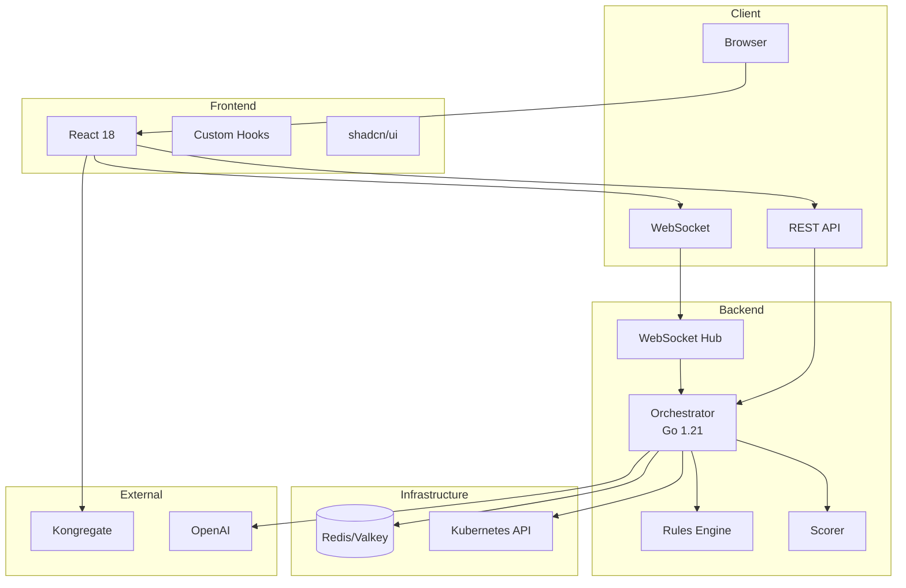

### Data Flow

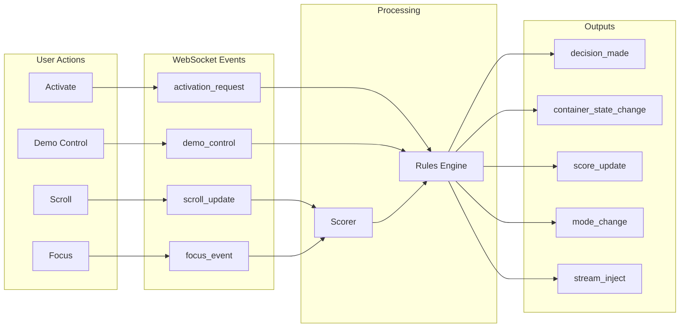

---

## Troubleshooting

### WebSocket Not Connecting

**Symptoms:**
- "Disconnected" shown in header
- No AI decisions appearing
- Scores not updating

**Solutions:**
1. Check browser console for errors
2. Refresh the page
3. Check if backend is running: `kubectl -n gavigo get pods`

### Game Not Loading

**Symptoms:**
- Blank iframe after activation
- Loading spinner stuck

**Solutions:**
1. Some games block iframe embedding - try a different game
2. Check browser console for CORS/CSP errors
3. Try disabling ad blockers

### Scores Not Updating

**Symptoms:**
- Score bars not filling
- No decisions generated

**Solutions:**
1. Ensure WebSocket is connected
2. Try scrolling or clicking on content
3. Check if focus events are being sent (browser console)

### Slow Performance

**Symptoms:**
- UI lag
- Delayed responses

**Solutions:**
1. Close other browser tabs
2. Switch to "Stream Only" view
3. Check network latency to server

---

## Summary

GAVIGO IRE demonstrates several key concepts:

1. **Intelligent Orchestration**: AI makes real-time decisions about resource allocation
2. **Predictive Scaling**: Containers warm before users need them
3. **Cross-Domain Discovery**: Content recommendations across media types
4. **Real-Time Communication**: WebSocket-based instant updates
5. **Modern UX**: TikTok-style interface with inline activation

For technical details, see [README.md](../README.md) and [CLAUDE.md](../CLAUDE.md).
